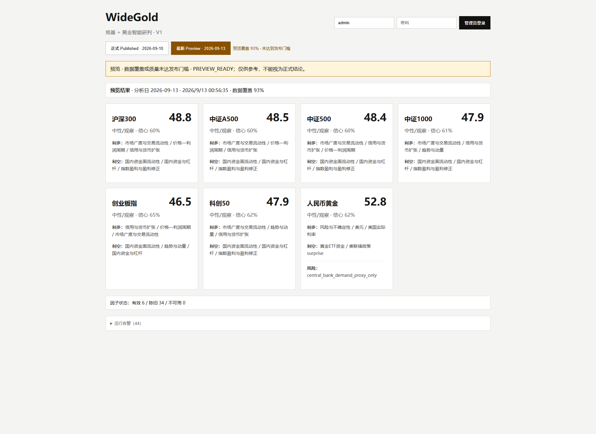
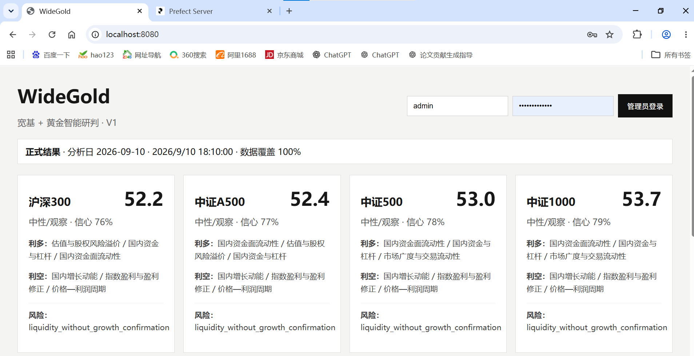
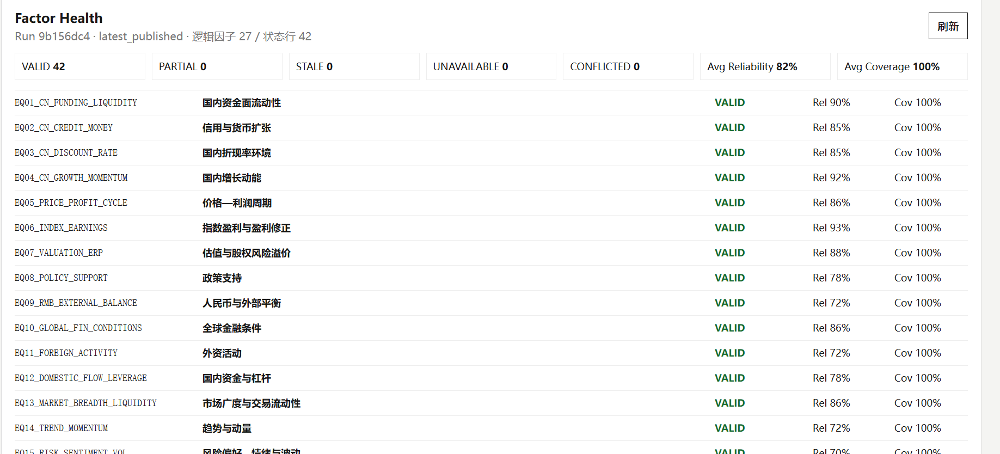
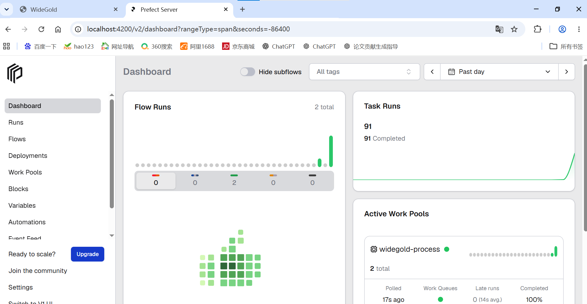

# WideGold Agent V1

> 面向普通投资者的宽基指数与人民币黄金市场环境智能研判系统。
>
> 本项目用于研究、工程验证与市场环境解释，不构成投资建议，也不保证任何资产未来收益。

WideGold V1 将宏观、利率、汇率、资金、市场状态、新闻事件与黄金供需等信息统一映射为可解释的因子状态，再由**确定性评分引擎**计算沪深300、中证A500、中证500、中证1000、创业板指、科创50和人民币黄金的环境支持度、Confidence 与风险提示。LLM 只负责非结构化信息理解、映射和解释，**不能直接生成最终资产分数**。

## 项目截图

### Dashboard



### Dashboard（历史截图）



### Factor Health



### Prefect Workflow



> 截图展示的是当前生产构建下的 Dashboard 双视图：正式 Published 与最新 Preview 分开展示，并明确标注预览质量状态。实时数据源、运行时间和 Runtime Config 不同，实际状态可能不同。

## 一、核心能力

- 7 类目标资产：沪深300、中证A500、中证500、中证1000、创业板指、科创50、人民币黄金。
- 27 个逻辑因子：A 股 15 个、黄金 12 个。
- 42 个物理 FactorState：对资产级因子按指数展开。
- Point-in-Time 数据模型：保存 `observation_date / release_ts / ingest_ts / revision_vintage / definition_version`。
- 因子状态：`VALID / STALE / PARTIAL / UNAVAILABLE / CONFLICTED`。
- 确定性评分：Factor State → Conflict/Group Cap → Asset Score → Confidence。
- Quality Gate：允许 Preview，阻止仅依赖 Last-Known-Good 旧数据生成新的 Published Snapshot。
- Prefect 3：生产级分析、Replay、Research、Calibration 的流程编排。
- LangGraph：事件理解、研究、解释、Scenario 等需要 LLM 条件路由的流程。
- Runtime Config：Git/YAML 负责 bootstrap，PostgreSQL ACTIVE 版本负责生产运行。
- Admin：登录、运行诊断、配置版本、Factor Health、Audit、手动 Preview/Publish。
- 统一免费 External Bridge：以一个 sidecar 提供 5 个外部能力，数据不足时明确降级，不伪造语义。
- Docker Compose：Windows 10/11、Linux 可使用同一套部署配置。

## 二、技术栈

| 层 | 技术 |
|---|---|
| 前端 | React 19 + TypeScript + Vite + ECharts |
| API | FastAPI + Pydantic v2 |
| ORM / Migration | SQLAlchemy 2 + Alembic |
| 工作流 | Prefect 3 |
| Agent Workflow | LangGraph |
| 数据库 | PostgreSQL 16 |
| Cache / Session / Lock | Redis 7 |
| 数据处理 | Pandas + NumPy + AKShare + HTTPX |
| LLM | Qwen / DeepSeek / OpenAI-Compatible Provider Adapter |
| 反向代理 | Nginx |
| 部署 | Docker Compose |
| Python | 3.11+ |

系统边界遵循：**事实获取归 Data，非结构化理解归 Graph，数值判断归 Engine，何时运行归 Prefect，状态持久化归 Repository/PostgreSQL。** 这一职责划分与原始架构设计一致。详见 [总体技术方案](docs/01_总体技术方案.md)。

## 三、最小启动

### Windows PowerShell

首次准备：

```powershell
cd widegold-agent
conda activate myenv
.\scripts\init-final-env.ps1
```

编辑 `.env`，至少填写：

```dotenv
POSTGRES_PASSWORD=请设置强密码
WIDEGOLD_BOOTSTRAP_ADMIN_PASSWORD=至少8位管理员密码
FRED_API_KEY=你的FRED_API_KEY
DEEPSEEK_API_KEY=你的LLM_API_KEY
```

然后只需要：

```powershell
.\scripts\quickstart.ps1
```

### Linux / macOS

```bash
cp .env.final.example .env
# 编辑 .env 后
./scripts/quickstart.sh
```

启动成功后：

- WideGold：<http://localhost:8080>
- Prefect：<http://localhost:4200>
- External Bridge：<http://localhost:9100/health>
- API Health：<http://localhost:8080/health>
- API Readiness：<http://localhost:8080/ready>

> 不要把 `.env` 提交到 Git。项目 `.gitignore` 已默认忽略它。

## 四、最小测试

不主动触发新的 LLM Analysis：

```powershell
.\scripts\quicktest.ps1
```

Linux：

```bash
./scripts/quicktest.sh
```

它依次执行：

```text
External Bridge Smoke（免费数据桥）
→ Docker E2E（不带 Analysis）
→ Release Gate（pytest / compile / frontend / compose）
```

如果要进行一次真实 Live Analysis（会消耗 LLM Token），显式执行：

```powershell
.\scripts\docker-e2e.ps1 -Analysis
```

不要把 Live Analysis 放进普通 CI，也不要在运行仍处于 `PENDING` 时反复触发新 Run。

## 五、Docker 服务

```text
nginx :8080
├── web
└── api

api / prefect-worker
├── PostgreSQL
├── Redis
├── Prefect Server :4200
├── LangGraph Checkpoint
├── External Bridge :9100
└── LLM Provider
```

主要 Compose 服务：

```text
postgres
redis
external-bridge
db-migrate
db-seed
langgraph-migrate
prefect-server
prefect-bootstrap
prefect-worker
api
web
nginx
smoke（tools profile）
```

## 六、核心分析链路

```text
18:10 定时 / 管理员手动触发
          ↓
       FastAPI
          ↓
 Prefect Deployment / Flow
          ↓
冻结 AnalysisContext + VersionSnapshot
          ↓
结构化数据采集 ───── 新闻/政策采集
          │                ↓
          │          Event Intelligence
          │             LangGraph
          └──────┬─────────┘
                 ↓
            Factor Inputs
                 ↓
            Factor State
                 ↓
         Conflict / Group Cap
                 ↓
            Asset Score
                 ↓
             Confidence
                 ↓
            Quality Gate
                 ↓
        Explanation / Snapshot
                 ↓
      Preview / Explicit Publish
                 ↓
              Dashboard
```

生产 Score 必须携带完整版本快照；Dashboard 只展示最新 `PUBLISHED` Snapshot，Preview 不会偷偷覆盖正式结果。

## 七、统一免费 External Bridge

当前单个 `external-bridge` 服务提供：

| Indicator | Capability | 免费数据策略 |
|---|---|---|
| `CN_DR007` | `china_money.dr007` | ChinaMoney FDR007 fixing proxy，明确标记 proxy，不用 FR007 冒充 |
| `CN_INDEX_EARNINGS_REV` | `equity_index.earnings_revision` | Eastmoney 盈利预测 + 指数成份 + 本地历史快照 |
| `CN_FOREIGN_ACTIVITY` | `china_equity.foreign_activity` | 仅使用可解释的方向性持股变化；免费披露不足则 UNAVAILABLE |
| `GLOBAL_CENTRAL_BANK_GOLD` | `gold.global_central_bank_demand` | WGC 公开数据 |
| `GOLD_SUPPLY_DEMAND` | `gold.supply_fabrication_demand` | WGC 公开供需数据 |

External Bridge 自己使用 SQLite Volume 做快照/缓存，WideGold PostgreSQL 仍然是业务 Point-in-Time 事实库。

## 八、项目目录

```text
widegold-agent/
├── apps/
│   ├── api/                 # FastAPI 入口与路由
│   ├── web/                 # React/Vite 前端
│   └── external_bridge/     # 免费 External Bridge HTTP 服务
├── src/widegold/
│   ├── data/                # Indicator 与 Provider
│   ├── db/                  # SQLAlchemy / Session / Materializer
│   ├── engine/              # 因子、评分、质量门等确定性核心
│   ├── graphs/              # LangGraph
│   ├── llm/                 # Model Router / Provider Adapter
│   ├── repositories/        # 数据访问边界
│   ├── services/            # Application Service
│   ├── settings/            # 静态与 Runtime Config
│   ├── workflows/prefect/   # Prefect Flow / Deployment
│   └── external_bridge/     # 5 个免费 External Adapter
├── configs/                 # bootstrap canonical YAML
├── migrations/              # Alembic
├── scripts/                 # 部署、诊断、测试、备份恢复
├── tests/                   # 回归测试
├── docs/                    # 中文文档
├── infra/                   # Docker/Nginx/PostgreSQL
├── docker-compose.yml
└── pyproject.toml
```

更详细的代码导读见 [代码结构与核心模块](docs/02_代码结构与核心模块.md)。

## 九、常用命令

```powershell
# 启动
.\scripts\quickstart.ps1

# 查看容器
docker compose ps

# Worker 日志
docker compose logs -f --tail=300 prefect-worker

# API 日志
docker compose logs -f --tail=200 api

# 免费 External 验证
python scripts/external_bridge_smoke.py

# 运行时配置漂移检查（只读；YAML 版本 vs 数据库 ACTIVE 版本）
docker compose exec api python scripts/sync_runtime_config.py --check

# 把仓库 YAML 版本激活为运行时配置
docker compose exec api python scripts/sync_runtime_config.py --activate-all

# LLM 契约探针（每个 alias 一次极小真实调用）
docker compose exec api python scripts/llm_probe.py

# 基础 E2E（不触发 Live Analysis）
.\scripts\docker-e2e.ps1

# Release Gate
.\scripts\release-gate.ps1 -RequireDocker

# 一次 Live Preview（会调用 LLM）
.\scripts\docker-e2e.ps1 -Analysis

# 停止但保留 Volume
docker compose down
```

**除非明确要清空数据库和 Bridge 历史，不要执行：**

```bash
docker compose down -v
```

## 十、当前已知限制

V1 已经完成工程闭环，但仍是研究/工程版本：

- 免费盈利修正需要累积本地历史快照，新安装初期会处于 warming。
- 免费外资方向性数据受公开披露频率限制，可能正常返回 `UNAVAILABLE`。
- 免费公网端点可能超时、改版或反爬，系统原则是降级而不是伪造数据。
- 最新实机 Live Preview 曾出现 Event Intelligence 的 LLM extraction fallback exhausted；事件子流程失败被隔离，主评分链仍可完成 Preview。该问题在本版本中保留为已知限制，不作为发布阻塞项。
- 最新实机 Preview 的总体 weighted coverage 很高，但 fresh coverage 尚不足 Publish Floor，因此 Quality Gate 正确阻止新的正式发布；已有 Published Snapshot 不受影响。
- 因子敏感度、阈值和部分权重属于 engineering priors，尚不等于已经完成 point-in-time walk-forward 校准的统计参数。

详见 [已知限制与后续方向](docs/06_已知限制与后续方向.md)。

## 十一、文档

- [总体技术方案](docs/01_总体技术方案.md)
- [代码结构与核心模块](docs/02_代码结构与核心模块.md)
- [部署与使用说明](docs/03_部署与使用说明.md)
- [测试与验收](docs/04_测试与验收.md)
- [数据、因子与评分说明](docs/05_数据因子与评分说明.md)
- [已知限制与后续方向](docs/06_已知限制与后续方向.md)
- [API 与运维速查](docs/07_API与运维速查.md)
- [本次发布验证报告](docs/08_本次发布验证报告.md)
- [GitHub 发布说明](docs/09_GitHub发布说明.md)
- [原始设计资料](docs/design/)

## 十二、安全与免责声明

API Key、数据库密码、管理员密码只能存放在 `.env`、Docker Secret 或操作系统环境变量中。禁止提交到 Git、写进前端 Bundle、日志或 Runtime Config 明文。

本项目提供的是**市场环境研究与解释工具**，不是自动交易系统，不提供收益保证，不构成投资建议。使用真实资金前，应自行完成数据许可确认、历史验证、风险评估和人工复核。
